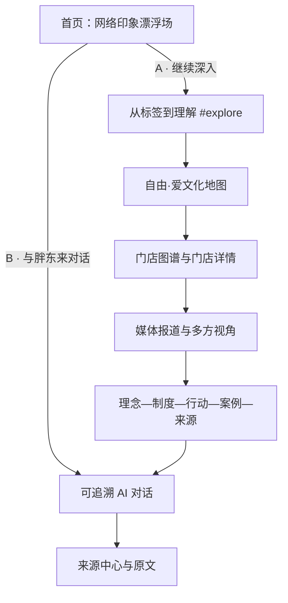
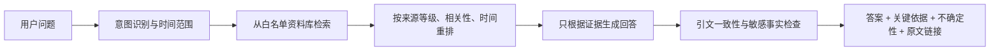

# 胖东来文化数字馆：产品、内容与实施计划

> 版本：v1.0（方案阶段）
>
> 日期：2026-07-22
>
> 项目目录：`D:\ai沙盒\codex+grok\pangdonglai_project`
>
> 项目性质：基于公开可核验资料构建的非官方文化学习与传播原型
>
> 核心问题：如何借助 AI 技术，让外界更深入地了解胖东来“自由·爱”的企业文化？

---

## 1. 执行摘要

这个项目不应被做成一个普通的“企业宣传网页”，也不应只重复“服务好、福利高、商超天花板”等网络标签。建议把整个产品定义为一条从印象走向理解的路径：

> **从网络印象进入，以公开证据理解，在 AI 对话中继续追问。**

页面的核心叙事分为三层：

1. **印象层**：首页用漂浮关键词呈现大众与媒体对胖东来的刻板印象、赞誉与疑问。
2. **理解层**：通过文化地图、门店图谱、新闻棱镜、故事档案和证据链，把标签还原成具体制度、行动和语境。
3. **对话层**：通过带来源、时间和不确定性说明的 AI 问答，让用户围绕“自由·爱”继续深入探索。

推荐的第一版成果不是立即接入一个会自由发挥的聊天机器人，而是先完成一个视觉完整、内容可追溯、可以持续扩充资料的前端产品；AI 接口在资料库和评测标准建立后再接入。

---

## 2. 现有 HTML 审阅结论

### 2.1 当前基础

现有文件为：

- `胖东来网页（7月22日1点34分）.html`
- 约 240 KB 的单文件 React 生产构建产物
- 已包含暖黑、米白、铜粉色的视觉体系
- 已有以下内容结构：
  - 文化地图
  - AI 回答框架预览
  - 理念到证据的证据链
  - 故事与档案
  - 来源中心
  - 非官方网站与资料核验免责声明

### 2.2 值得保留的部分

- “不是重述口号，而是呈现证据链”的产品态度。
- “员工、顾客、商品、经营”四个文化观察方向。
- AI 回答中“简明回答—关键依据—不确定性—来源列表”的结构。
- A/B/C/D 来源等级思想。
- 暖黑、纸张米白、铜色点缀的编辑型视觉语言。
- 明确声明“非官方学习与传播原型”。

### 2.3 当前主要问题

1. **只有构建产物，没有可维护源码**：继续直接修改这个 HTML 会越来越难维护。
2. **首页存在多代覆盖代码**：文件实际包含 8 个 `<script>` 和 9 个 `<style>`；基础样式之外又叠加了多组首页轨道、嵌套轨道、三轨道、去重叠、最终润色脚本，后续不宜再堆补丁。
3. **关键词数量过多**：现有列表超过百条，移动端和低性能设备容易拥挤、重叠或消耗性能。
4. **首页主叙事还不够聚焦**：视觉有气氛，但“双锚点”和“从印象到证据”的下一步没有成为明确动作。
5. **门店与新闻功能尚不存在**：当前只有故事占位，没有真实数据、筛选、详情页和外部报道链接。
6. **AI 仍是骨架**：没有真实输入、检索、回答、引文绑定和错误处理。
7. **存在外部视频资源**：正式版本要确认版权、可用性和加载失败时的降级方案。
8. **Hero 资源与事件存在隐患**：最终样式引用了当前目录中不存在的 `hero-bg.png`；多轮脚本直接改写 React 管理的 DOM，旧动画帧与监听器也未完整清理。
9. **交互语义断开**：最终 Hero 替换掉了原来的导航、输入框和 CTA，只剩不可点击的“向下探索”；关键词又被设置为不可接收指针事件，已有悬停样式实际上无法触发。
10. **项目文件尚未形成源码目录与数据目录**：不利于 Codex 实现、Grok 核验和 Git 小步交接。

### 2.4 实施建议

不要继续在现有压缩 HTML 尾部追加覆盖脚本。进入开发阶段后，应先保留该文件作为原型归档，再以 React 源码重建可维护版本；视觉与文案可以继承，代码结构重新整理。

---

## 3. 产品定位

### 3.1 一句话定位

一个以公开证据为基础、以 AI 对话为入口，帮助公众理解胖东来“自由·爱”文化如何落到真实制度与行动中的非官方数字文化馆。

### 3.2 核心价值

- 对普通访客：不只看热搜，快速形成结构化理解。
- 对消费者和游客：了解门店、位置、特点与相关公开资料。
- 对企业管理者和学习者：从理念、制度、行动、结果的链条研究其经营实践。
- 对研究者和媒体读者：找到原始来源、发布日期、来源等级与不同观点。
- 对项目团队：建立一个可以持续加入资料、门店、报道和 AI 能力的内容底座。

### 3.3 产品边界

- 本项目不是胖东来官方网站，不代表企业发言。
- “与胖东来对话”是用户要求的入口文案；实际产品身份应标明为“胖东来文化资料助手（非官方）”。
- 未经核验的网络传言只能作为“待核验印象”出现，不能当作事实陈述。
- 不复制新闻全文，不擅自使用媒体图片；只使用短摘要、标题、来源与原文链接。
- 不在前端保存任何模型密钥或地图服务密钥。

---

## 4. 整体信息架构



建议的首页长页顺序：

1. Hero 首页：关键词、中心标题、A/B 双锚点
2. 从标签到理解：解释本项目为什么存在
3. “自由·爱”文化地图：员工、顾客、商品、经营与社会
4. 门店图谱：照片、城市、地址、内部详情页
5. 媒体棱镜：报道链接与不同观察角度
6. 文化证据链：理念如何走向制度、行动与案例
7. 故事与时间轴：按主题或年份探索
8. AI 对话：问题输入、回答、证据与来源
9. 来源中心与项目说明

顶部导航在离开首屏后出现，建议包含：

- 理解文化
- 门店图谱
- 媒体报道
- 证据链
- AI 对话
- 来源中心

---

## 5. 首页 Hero 详细方案

### 5.1 推荐中心文案

视觉上分成三层，但语义组成一句完整的话：

```text
不要只停留在表面——
理解胖东来
从理解人开始
```

辅助说明建议为：

> 从网络标签出发，用门店、报道与可追溯的 AI 证据，理解“自由·爱”如何落在真实制度和行动中。

### 5.2 关键词的内容策略

关键词不是装饰，它们代表“外界怎样想象胖东来”。所有关键词建议带问号，避免把印象直接写成事实。

首批可分四组：

- 员工印象：`神仙工作？`、`民间公务员？`、`反内卷？`、`高薪高福利？`、`周二闭店？`、`委屈奖？`
- 消费体验：`服务天花板？`、`透明定价？`、`无忧退换？`、`细节拉满？`、`购物安心？`
- 企业经营：`零售界清流？`、`行业教科书？`、`不盲目扩张？`、`不可复制？`、`商业理想主义？`
- 舆论与城市：`6A级景区？`、`一店带火一城？`、`被过度神化？`、`管理边界？`、`自由与爱？`

注意：

- 第一屏桌面端控制在 18—24 个词，手机端只显示 8—12 个。
- 关键词数据要保存来源、日期、分类和核验状态。
- 正式内容中要同时保留赞誉、疑问和批评，不把页面做成单向赞美。
- 点击关键词可在后续版本打开“印象卡”：显示这个标签来自哪里、能被哪些事实支持、还存在哪些争议。
- 如果关键词只是气氛装饰，应统一 `aria-hidden="true"`；如果可以点击，则必须改成真正的 `<button>`，支持焦点、键盘与可见提示，不能处在 `pointer-events: none` 容器中。

### 5.3 动态效果

建议采用“编辑式漂浮星群”，不再使用大量文字持续绕同一椭圆高速运行：

1. 页面进入时，关键词从轻微模糊、低透明度状态逐层浮现。
2. 中心附近文字更清晰，远处文字透明度更低，形成空间深度。
3. 每个词沿固定的小范围轨迹缓慢漂移，周期 12—24 秒，避免明显重复。
4. 鼠标移动只产生 4—12 px 的轻微视差，不追逐鼠标。
5. 悬停关键词时暂停该词并显示来源类别；中心标题始终不移动。
6. 页面滚动离开首屏后暂停动画，返回时恢复。
7. `prefers-reduced-motion: reduce` 下取消漂浮，只保留静态排版与淡入。

为避免重叠，应使用按断点预先设计的坐标，而不是每次加载完全随机。这样 Codex 能精确实现，Grok 也能稳定复测。

### 5.4 A/B 双锚点设计

两个锚点设计成“展览坐标牌”，放在中心标题右下侧；移动端放在标题下方并排或纵向排列。

#### A 锚点

- 显示：`A` + `继续深入`
- 辅助小字：`从标签到证据`
- 视觉：米白描边、透明底、向下箭头
- 目标：`#explore`
- 点击：平滑滚动到下一段详情界面

#### B 锚点

- 必须显示用户指定文案：`与胖东来对话`
- 显示：`B` + `与胖东来对话`
- 辅助小字：`AI 文化资料助手`
- 视觉：铜粉色实底、深色文字、对话气泡图标
- 目标：`#ai-dialogue`
- 点击：平滑滚动到 AI 区域；第一版显示“功能开发中”和示例问题，不伪装成已经联网的真实回答

交互要求：

- 使用真实 `<a href="#...">`，JavaScript 只是增强动画，脚本失败仍能跳转。
- 键盘 Tab 可聚焦，Enter/Space 可触发。
- 使用 `scroll-margin-top` 避免标题被固定导航遮住。
- 尊重减少动态效果设置，必要时立即跳转。
- URL hash 可被复制和直接访问。
- 动画完成后把程序焦点移到目标栏目标题，让键盘和读屏用户明确知道已到达新区域。

### 5.5 首页验收标准

- 360×800、768×1024、1440×900 三种视口均无文字覆盖中心标题。
- A、B 锚点均可用鼠标和键盘触发。
- A 到 `#explore`，B 到 `#ai-dialogue`，落点标题完整可见。
- 关键词离屏后不继续消耗动画帧。
- 减少动态模式下没有持续位移动画。
- 首屏没有未经来源支持的确定性事实表述。

---

## 6. “从标签到理解”详情界面

这个栏目使用 `id="explore"`，承接 A 锚点，是整个产品从视觉吸引转向内容理解的关键。

推荐标题：

> **标签很响亮，但理解需要证据。**

采用左右对照或卡片展开：

| 网络印象 | 深入问题 | 应进入的证据 |
|---|---|---|
| “员工神仙待遇” | 哪些是制度，哪些只是个案？ | 官方制度、员工资料、权威采访、时间范围 |
| “服务天花板” | 服务如何被标准化并持续执行？ | 服务标准、实际案例、第三方观察 |
| “不逐利的企业” | 商业收益与社会价值如何平衡？ | 经营理念、公开数据、研究案例 |
| “6A级景区” | 热度如何改变门店与城市？ | 客流报道、城市文旅资料、门店信息 |
| “被过度神化” | 赞誉之外有哪些争议和边界问题？ | 完整事件、不同媒体观点、企业回应 |

每张卡片都应有：`印象`、`事实状态`、`资料数量`、`最后核验日期` 和 `继续查看`。

---

## 7. “自由·爱”文化地图

保留现有四象限，同时增加“社会关系”作为第五个观察角度：

1. **员工文化**：尊重、成长、工作与生活、分配与制度。
2. **顾客服务**：公平、专业、便利、售后与信任。
3. **商品与品质**：安全、实在、专业标准、信息透明。
4. **经营实践**：克制扩张、组织方式、供应链与长期主义。
5. **社会关系**：城市、行业学习、社会责任与公共讨论。

每个主题页或抽屉遵循同一结构：

```text
理念原文 → 制度设计 → 真实行动 → 具体案例 → 原始来源 → 不确定/争议
```

现有“理念—制度—行动—案例—来源”的证据链可以直接成为整个项目的统一内容模板。

---

## 8. 门店图谱与详情页方案

### 8.1 门店首页模块

栏目标题建议：

> **文化发生的地方**

布局建议：

- 左侧或上方：许昌、新乡两地的简化地图/城市切换。
- 右侧或下方：门店照片卡片网格。
- 筛选：`全部`、`许昌`、`新乡`、`综合商场`、`社区门店`、`专业门店`。
- 卡片信息：门店名、城市、地址短句、门店类型、最后核验日期。
- 点击照片或“查看门店”进入本项目内部详情页，不直接把用户扔到外站。
- 卡片内另设“官方信息”小链接，指向胖东来官方页面。

### 8.2 首批门店范围

根据胖东来官方页面，首批按 14 家实体门店建立数据：

| 城市区域 | 门店 |
|---|---|
| 许昌 | 许昌天使城、许昌时代广场、许昌生活广场、许昌大众服饰、许昌金三角店、许昌云鼎店、许昌北海店、许昌金汇店、许昌劳动店、许昌人民店 |
| 禹州 | 禹州店 |
| 新乡 | 新乡大胖、新乡二胖、新乡三胖 |

物流中心和中央厨房可以在“运营设施”专题中出现，但不要与对公众营业的门店混在同一筛选结果里。

官方简介中的“6 家综合型百货、13 家超市、1 家服饰鞋业专业门店”是业态交叉统计，不能相加理解为 20 家独立门店。禹州店在官方联系页中归入许昌地区，项目可以在界面上显示“禹州”，但数据来源和筛选逻辑要注明这一差异。

### 8.3 门店详情页

推荐路由：

- `/stores`
- `/stores/xuchang-angel-city`
- `/stores/xuchang-times-square`
- `/stores/xinxiang-dapang`

每个详情页包含：

1. 获得授权的主图与图集。
2. 门店名、城市、门店类型、开业时间。
3. 地址与“在地图中打开”。
4. 营业时间，并显示“请以官方当日信息为准”。
5. 经营业态与空间特点。
6. “在这家店里观察什么”：与服务、员工、商品、经营相关的内容入口。
7. 相关官方资料与媒体报道。
8. 来源、最后核验日期和更新记录。
9. 上一家/下一家门店导航。

### 8.4 地图实现分两步

第一版：

- 不接入地图 SDK。
- 地址旁提供高德地图或百度地图搜索深链。
- 不需要 API Key，风险和开发量较小。

第二版：

- 用户确认地图供应商后再接入高德地图 JS API。
- API Key 仅放服务端或受限制配置中，不提交到 Git。
- 地图标点来自已核验坐标，点击与门店卡片联动。

### 8.5 照片策略

- 优先级 1：用户本人拍摄或用户明确授权的照片。
- 优先级 2：胖东来官方明确允许转载/使用的媒体素材。
- 优先级 3：带明确许可的图库或摄影者授权作品。
- 未获得授权前使用高质量的几何/建筑占位图，不使用 AI 生成的“假门店照片”。
- 不直接热链媒体图片；每张图片保存作者、来源、许可、拍摄时间与替代文本。
- 可以把[官方门店 720° 展示入口](https://i.azpdl.cn/pdl-index/event/virtual-store/list.html)作为“查看官方展示”的外链，但未经书面许可，不下载、截图或重新托管其中图片。
- 自行拍摄时如顾客或员工面部可识别，应取得同意、避开正脸或进行模糊处理。

建议建立 `assets/ATTRIBUTION.md` 记录所有图片授权。

---

## 9. 媒体报道模块

### 9.1 模块定位

栏目名建议：

> **媒体棱镜：同一家企业，不同的观察角度**

它不是新闻搬运站，而是经过筛选的外部报道导航。

### 9.2 卡片字段

- 标题
- 媒体/机构
- 发布日期
- 主题：员工、顾客、商品、经营、城市、争议、行业影响
- 观察角度：事实报道、案例研究、评论、企业回应
- 80 字以内摘要（团队自己撰写）
- 来源等级
- `阅读原文 ↗`
- 最后检查链接日期

外部链接使用新窗口打开，并设置 `rel="noopener noreferrer"`。

### 9.3 筛选与排序

- 按年份筛选。
- 按主题筛选。
- 按来源等级筛选。
- 默认按发布时间倒序。
- 提供“只看官方/公共来源”。
- 对同一事件把企业回应、事实报道和评论观点放在一组，减少断章取义。
- 首页只展示 6—8 条精选报道；独立报道页首批收录 12—20 条，避免首页变成链接墙。

### 9.4 首批可核验来源候选

| 来源 | 建议用途 |
|---|---|
| [胖东来官方简介](https://web.azpdl.cn/about) | 企业与门店基本资料 |
| [胖东来官方门店信息](https://web.azpdl.cn/contact) | 地址、营业时间、联系方式 |
| [胖东来官方文化理念 PDF](https://i.azpdl.cn/pdl-index/pdf/culture/20241205_1.pdf) | “自由·爱”与经营理念原文 |
| [胖东来官方文化网页](https://i.azpdl.cn/pdl-index/event/book/intro.html) | 文化内容的可浏览版本与版本对照 |
| [新华每日电讯：解码胖东来，何以“出圈”又“出彩”](https://www.news.cn/mrdx/2024-03/19/c_1310768126.htm) | 员工、服务、行业与城市影响 |
| [新华网：何以胖东来——一家“网红”商超的坚守与嬗变](https://www.news.cn/fortune/20241008/ae395f208ac74e0d81537c43116f55c6/c.html) | 起源、品质、服务制度与行业帮扶 |
| [清华经管：践行企业社会责任，重塑零售价值链](https://www.sem.tsinghua.edu.cn/info/1173/37297.htm) | 案例研究与利益相关者视角 |
| [工人日报：尝面员工由辞退改转岗，给企业用工带来什么启示](https://www.workercn.cn/papers/grrb/2024/02/23/5/news-1.html) | 管理制度、劳动关系与事件复盘 |
| [北京商报：胖东来13页报告给所有企业上了一堂企业文化课](https://www.bbtnews.com.cn/2024/0219/504255.shtml) | 舆论争议与企业回应 |
| [每日经济新闻：2024年经营数据与员工收入公开信息](https://m.nbd.com.cn/articles/2025-01-08/3714842.html) | 公开经营数据及其出处说明 |
| [人民网河南：胖东来经验变“省级模板”](https://henan.people.com.cn/n2/2026/0130/c351638-41488321.html) | 行业影响与地方标准 |
| [央视网：实地探访为什么胖东来能火出圈](https://v.cctv.com/2024/12/17/VIDESm2v0PQFOBQygxgAuXyo241217.shtml) | 视频报道与公众关注 |
| [央视网：代购扫货，胖东来有了“差评”](https://news.cctv.com/2024/04/22/ARTIkbVoJeShAGIdzvXm01F2240422.shtml) | 流量、缺货、代购与经营挑战 |

这些链接只能作为首批候选。Grok 在内容入库前还要逐条核验可访问性、发布时间、原始出处和内容是否被更新。

---

## 10. AI 对话方案

### 10.1 产品身份

入口按钮按用户要求显示“与胖东来对话”，AI 区域内部明确写：

> **胖东来文化资料助手（非官方）**
>
> 根据已收录的公开资料回答，不代表胖东来或其员工观点。

### 10.2 第一版：可见但不伪装

在后端尚未开发时：

- B 锚点可以正常滚动到 AI 区域。
- 展示问题输入框、建议问题和回答结构。
- 提交按钮显示“功能开发中”或运行本地示例演示。
- 示例回答必须明显标记为“结构示例”。
- 不生成任何看起来像真实事实、却没有来源的内容。

建议问题：

- “胖东来所说的‘自由·爱’具体指什么？”
- “员工文化与顾客服务之间有什么关系？”
- “为什么胖东来没有大规模全国扩张？”
- “关于胖东来被‘神化’的争议有哪些不同观点？”
- “某项广为流传的员工福利有原始出处吗？”

### 10.3 第二版：基于检索增强生成（RAG）

回答流程：



每次回答固定包含：

1. **简明回答**：先回答问题，不绕弯。
2. **关键依据**：把核心结论拆成 2—5 条。
3. **证据链**：理念、制度、行动、案例之间如何连接。
4. **来源列表**：标题、发布者、日期、等级、原文链接。
5. **不确定性**：资料不足、来源冲突或时间过旧时明确说明。
6. **继续追问**：给出 2—3 个相关问题。

### 10.4 资料入库流程

```text
收集链接 → 版权与来源检查 → 文本提取/OCR → 去重 → 分段
→ 增加元数据 → 人工核验 → 建立索引 → 测试问答 → 发布
```

每段资料至少保存：

- `sourceId`
- 标题
- 发布者
- 原始 URL
- 发布日期
- 获取日期
- 来源等级
- 主题标签
- 适用门店/事件
- 原文片段位置或页码
- 核验状态
- 是否允许展示摘要/图片

### 10.5 来源等级建议

- **A级**：胖东来官网、官方账号、正式公开文件与原始报告。
- **B级**：政府、法院、大学、新华社、人民日报、央视等公共或权威机构。
- **C级**：有署名、有完整语境的专业媒体、完整采访与行业研究。
- **D级**：可追溯到原始发布者的社交平台内容，仅作为舆论材料。
- **E级**：截图、转述、匿名爆料、无原始链接内容；只能进入待核验区，不进入 AI 确定性回答。

现有页面的 A—D 四级体系建议扩充为 A—E，以便把“可讨论的舆论材料”和“完全不可靠内容”分开。

### 10.6 AI 安全与质量要求

- 检索资料只来自审核白名单，不让模型直接把全网搜索结果当事实。
- 外部网页中的指令性文本视为不可信内容，不能改变系统规则。
- 结论必须能对应到具体来源；找不到证据就回答“目前资料不足，无法确认”。
- 涉及收入、工时、门店数量、经营数据等会变化的信息必须显示时间。
- 涉及个人、劳动争议和负面事件时，区分指控、报道、企业回应与司法结论。
- 不模仿于东来或企业员工口吻，不制造“胖东来本人回答”的误导。
- 模型密钥只放服务端环境变量，永不写入前端和 Git。
- 建立至少 30 个标准问题的评测集，检查准确性、引文一致性、拒答能力和观点平衡。
- 官方文化网页与 PDF 也可能出现版本差异；入库时保留版本号、抓取日期和原始链接，不用新版本静默覆盖旧版本。

---

## 11. 其他值得加入的功能

### 11.1 印象解剖台（高优先级）

用户点击首页关键词，看到：

- 这个标签的来源与传播时间。
- 支持它的事实。
- 不能由现有资料证明的部分。
- 相关争议或相反观点。
- 向 AI 继续追问。

这会把首页视觉效果真正转化为产品功能。

### 11.2 “一句理念如何落地”互动链（高优先级）

用户选择“自由、爱、真诚、公平、专业”等词，页面逐步展开：理念原文、制度、行动、案例、来源。它可以复用现有证据链组件。

### 11.3 胖东来时间轴（中优先级）

- 展示企业发展、门店、公开制度、重大事件与行业影响。
- 每个节点必须附原始来源。
- 争议事件显示“事件—回应—后续”完整链条。

### 11.4 媒体观点对照（中优先级）

同一主题同时呈现正面观察、质疑观点和公开回应，帮助用户理解复杂性，避免“造神式”叙事。

### 11.5 我的探索路径（后续）

为不同访客提供入口：

- 我是普通消费者
- 我是企业管理者
- 我是学生/研究者
- 我准备去门店参观

系统据此推荐不同内容顺序，不需要收集个人身份信息。

### 11.6 引用导出（后续）

允许用户复制一段结论及其来源，或导出简单的参考资料清单，强化学习与研究用途。

---

## 12. 数据与内容结构

建议把可变内容从组件中分离，使用 TypeScript/JSON 数据文件：

```text
src/
  app/
  components/
    hero/
    culture/
    stores/
    media/
    ai/
    sources/
  pages/
    HomePage.tsx
    StoresPage.tsx
    StoreDetailPage.tsx
    SourceCenterPage.tsx
  data/
    keywords.ts
    stores.ts
    reports.ts
    cultureTopics.ts
    sources.ts
  styles/
  lib/
public/
  images/
    stores/
  documents/
docs/
  content/
  qa/
```

门店数据示例：

```ts
type Store = {
  id: string;
  slug: string;
  name: string;
  city: '许昌' | '禹州' | '新乡';
  type: '综合商场' | '社区门店' | '专业门店';
  address: string;
  hoursNote: string;
  mapUrl: string;
  officialUrl: string;
  image: AssetReference | null;
  openingDate?: string;
  features: string[];
  sourceIds: string[];
  verifiedAt: string;
};
```

报道数据示例：

```ts
type Report = {
  id: string;
  title: string;
  publisher: string;
  publishedAt: string;
  url: string;
  topic: string[];
  perspective: '事实报道' | '案例研究' | '评论' | '企业回应';
  sourceGrade: 'A' | 'B' | 'C' | 'D' | 'E';
  summary: string;
  checkedAt: string;
};
```

---

## 13. 技术方案

### 13.1 前端

推荐：

- Vite
- React
- TypeScript
- vinext / Next App Router（由 Vite 驱动）
- CSS Modules 或整理后的 Tailwind CSS（二选一，不混乱叠加）
- Lucide 图标

理由：现有页面本身就是 React 构建产物，重建后能保留组件思路，同时获得源码、路由、数据模型和可测试性。

### 13.2 第一阶段不需要的内容

- 不急于引入大型 CMS。
- 不急于接数据库。
- 不急于接地图 SDK。
- 不急于部署真实 AI。
- 不需要用户登录与个人资料。

这些延后可以减少安全风险，让第一版先把叙事、门店和来源做扎实。

### 13.3 AI 后端阶段

后端可采用 Node.js API 或无服务器函数，具体部署平台由用户后续决定。接口至少包括：

- `POST /api/chat`
- `GET /api/sources/:id`
- `GET /api/stores`
- `GET /api/reports`

所有模型调用、检索与来源过滤发生在服务端。

### 13.4 性能与可访问性目标

- Lighthouse Performance ≥ 90。
- Accessibility ≥ 95。
- Cumulative Layout Shift（CLS）< 0.1。
- 首屏图片使用 AVIF/WebP，并提供尺寸，防止布局跳动。
- 门店图集懒加载。
- 首屏不强制播放大视频；如使用视频，必须有静态封面与关闭动态选项。
- 无 JavaScript 时锚点和基本内容仍可访问。
- 文本与背景对比度符合 WCAG AA。
- 所有图片有有意义的中文替代文本。

---

## 14. 开发阶段与里程碑

### 阶段 0：方案与内容准备

目标：确定页面结构、文案、资料边界和素材状态。

- [x] 审阅现有 HTML。
- [x] 形成产品与实施计划。
- [ ] 用户确认中心标题、整体叙事与页面顺序。
- [ ] 用户决定首版使用真实照片还是占位图。
- [ ] Grok 核验首批官方与媒体来源。

验收：计划获用户确认，所有未决定事项有明确结论。

### 阶段 1：工程重建与首页

目标：建立可维护源码并完成 Hero、导航和 A/B 锚点。

- 归档现有单文件原型。
- 创建 Vite + React + TypeScript 源码。
- 建立设计变量与响应式布局。
- 实现漂浮关键词、双锚点和减少动态模式。
- 建立基础导航、页脚和非官方声明。

验收：三种视口无重叠；双锚点和键盘导航通过。

### 阶段 2：理解层内容

目标：完成“从标签到理解”、文化地图和证据链。

- 建立统一内容卡片结构。
- 关键词可进入印象解释卡。
- 文化主题与来源记录关联。

验收：每个确定性结论都有来源或明确标为待核验。

### 阶段 3：门店图谱与详情页

目标：完成 14 家门店的数据、筛选和内部详情页。

- 建立门店数据模型。
- 完成城市和类型筛选。
- 建立 14 个可访问的详情路由。
- 接入地图深链。
- 处理授权图片或占位图。

验收：14 家门店均能从卡片进入详情；地址、官方链接和核验日期齐全。

### 阶段 4：媒体报道与来源中心

目标：形成多角度报道导航和可审计来源库。

- 建立报道数据文件。
- 完成年份、主题、来源等级筛选。
- 把同一事件的报道、回应和评论关联起来。
- 建立来源详情与失效链接处理。

验收：外链检查通过；页面不复制受版权保护的全文或图片。

### 阶段 5：AI 界面原型

目标：完成对话体验和接口契约，但不伪造真实能力。

- 输入框、推荐问题、加载/错误/无证据状态。
- 回答、依据、不确定性与来源组件。
- 使用固定测试数据进行交互演示。

验收：用户能理解未来 AI 如何工作，也能清楚知道当前是否连接真实知识库。

### 阶段 6：RAG 与评测

目标：接入经过审核的资料库和模型。

- 资料提取、分段、元数据和索引。
- 检索、重排、回答与引文绑定。
- 30+ 问题评测集。
- 注入攻击、来源冲突、过期资料和无答案测试。

验收：回答中的核心断言可追溯；证据不足时稳定拒答；密钥不进入前端或 Git。

### 阶段 7：发布前验收

- 响应式、键盘、减少动态模式。
- 性能和浏览器兼容。
- 全量链接与来源检查。
- 图片授权与署名检查。
- 用户最终验收。

---

## 15. Codex、Grok 与用户的明确分工

### 15.1 Codex 主责

- 把现有单文件原型重建为可维护源码。
- 首页视觉、漂浮关键词、A/B 锚点与响应式实现。
- 门店列表、详情路由、新闻卡片和来源中心开发。
- AI 对话界面、API 契约、RAG 后端与引文展示实现。
- 单元测试、组件测试和发现问题后的代码修复。
- 每完成一个可验收小项，更新 `docs/HANDOFF.md` 并小步提交。

建议 Codex 主要拥有：

- `src/**`
- `public/**`
- 构建配置
- 实施相关技术文档

### 15.2 Grok 主责

- 核验官方门店、地址、营业时间、报道链接和发布日期。
- 审查 Codex 的 Git diff，确认没有继续向旧 HTML 叠加不可维护补丁。
- 运行开发、构建、链接检查和响应式验证命令。
- 按 360、768、1440 视口检查关键词重叠与锚点落点。
- 建立 `docs/SOURCE_AUDIT.md`，记录来源等级、失效链接和争议资料。
- 建立 `docs/QA_REPORT.md`，记录功能、可访问性、性能和 AI 评测结果。
- AI 阶段重点验证引文是否真正支持回答、无资料时是否会拒答。

建议 Grok 主要拥有：

- `docs/SOURCE_AUDIT.md`
- `docs/QA_REPORT.md`
- 验证脚本和测试报告

### 15.3 用户主责

- 拍板中心文案、设计方向和栏目优先级。
- 提供或确认门店图片授权。
- 决定地图供应商、AI 模型/平台、部署位置和预算。
- 对争议内容的呈现尺度与最终发布内容做最终确认。
- 完成视觉和产品终验。

### 15.4 换手规则

1. 两位 Agent 每次开工前都先读 `AGENTS.md`、`docs/PLAN.md`、`docs/HANDOFF.md` 和本计划。
2. 同一时刻只由一方修改同一批文件。
3. Codex 实现一个小阶段并提交 Git。
4. Grok 基于该提交验收，把结果写入 QA/来源报告和 HANDOFF。
5. Codex 只修复报告中明确列出的问题，再提交。
6. 用户在阶段边界拍板，不依赖聊天记录传递关键决定。
7. `docs/HANDOFF.md` 是当前状态的唯一交接入口；本文件记录稳定方案，不记录每次小改动。

---

## 16. 验收清单

### 首页

- [ ] 中心标题准确呈现“不要只停留在表面——理解胖东来，从理解人开始”。
- [ ] 周围关键词同时包含赞誉、疑问和批评视角。
- [ ] 关键词不遮挡标题与锚点。
- [ ] A 平滑进入详情，B 平滑进入“与胖东来对话”。
- [ ] 键盘、减少动态模式和移动端通过。

### 门店

- [ ] 14 家实体门店的数据与官方页面一致。
- [ ] 卡片点击进入本项目详情页。
- [ ] 详情页含地址、营业提示、地图链接、来源和核验日期。
- [ ] 图片均有授权记录或明确占位。

### 报道

- [ ] 外链直接指向原始媒体/机构页面。
- [ ] 标题、媒体、时间和主题齐全。
- [ ] 不转载全文和无授权图片。
- [ ] 同一争议尽量同时呈现事实、回应和不同观点。

### AI

- [ ] 明确标识非官方资料助手。
- [ ] 回答带依据、来源、日期和不确定性。
- [ ] 没有证据时不猜测。
- [ ] 引文与结论一致。
- [ ] 密钥不在前端和 Git。

### 工程质量

- [ ] 有源码、构建命令和 README。
- [ ] 不继续在旧构建产物上堆覆盖脚本。
- [ ] 开发与生产构建通过。
- [ ] Lighthouse 和基础可访问性目标达标。
- [ ] HANDOFF、QA 和来源审计文件齐全。

---

## 17. 当前需要用户拍板的事项

进入代码实现前，只需要确认以下内容：

1. 是否接受“从印象到证据，再到对话”的整体叙事。
2. 首页中心文案是否采用本计划推荐版本。
3. 第一版门店照片使用用户授权真实照片，还是先用设计占位图。
4. AI 第一版是否只做完整界面原型，待内容库建好后再接真实模型。
5. 是否同意展示适量质疑/争议，让页面避免单向宣传。

如果用户没有额外修改，推荐默认选择为：接受整体叙事、采用推荐文案、门店先用占位图、AI 先做可验证的界面原型、媒体模块保留多方视角。

---

## 18. 风险清单

| 风险 | 处理方式 |
|---|---|
| 关键词被误认作事实 | 全部使用问号和“网络印象”标签，绑定来源与核验状态 |
| 页面变成企业宣传 | 保留疑问、批评、争议和不确定性说明 |
| AI 编造制度或数据 | 白名单 RAG、句级引文、无证据拒答、评测集 |
| 门店信息过时 | 显示最后核验日期，定期由 Grok 对照官方页面 |
| 新闻链接失效 | 定期链接检查，保存元数据但不镜像受版权保护内容 |
| 图片侵权 | 用户授权优先，建立 ATTRIBUTION，未授权使用占位图 |
| 商标或“官方”混淆 | 不把胖东来文字/标志作为本站自身品牌，显著展示非官方说明 |
| 可识别人物肖像 | 自摄素材先获同意，或避开正脸、模糊处理 |
| 外部地图/API 泄露密钥 | 第一版使用地图深链，后续密钥仅在服务端或受限配置 |
| 首页动画卡顿 | 限制关键词数、离屏暂停、减少动态模式、移动端降级 |
| 旧 HTML 难维护 | 归档原型，从 React/TypeScript 源码重建 |
| Codex/Grok 相互覆盖 | 文件归属、Git 小提交、HANDOFF 顺序换手 |

---

## 19. 推荐的下一步

1. 用户审阅并确认第 17 节的五项决定。
2. Grok 对本计划的门店与来源候选做一次独立核验，并写入 `docs/SOURCE_AUDIT.md`。
3. 用户确认后，由 Codex 开始“阶段 1：工程重建与首页”。
4. 阶段 1 完成后由 Grok 做首轮响应式、性能与 diff 验收。

在用户确认前，不修改现有网页视觉和业务代码。

### 合规参考

- [国家版权局：关于规范摄影作品版权秩序的通知](https://www.ncac.gov.cn/xxfb/flfg/gfxwj/202006/t20200611_50562.html)
- [最高人民法院：民法典关于肖像权的相关说明](https://www.court.gov.cn/zixun/xiangqing/233181.html)
- [国家市场监督管理总局：中华人民共和国商标法](https://www.samr.gov.cn/zw/zfxxgk/fdzdgknr/fgs/art/2023/art_3107cd5f8af445619ec74267aaebcc7f.html)
- [高德地图 URI API](https://lbs.amap.com/api/uri-api/gettingstarted)
- [高德开放平台服务协议](https://lbs.amap.com/pages/terms/)
